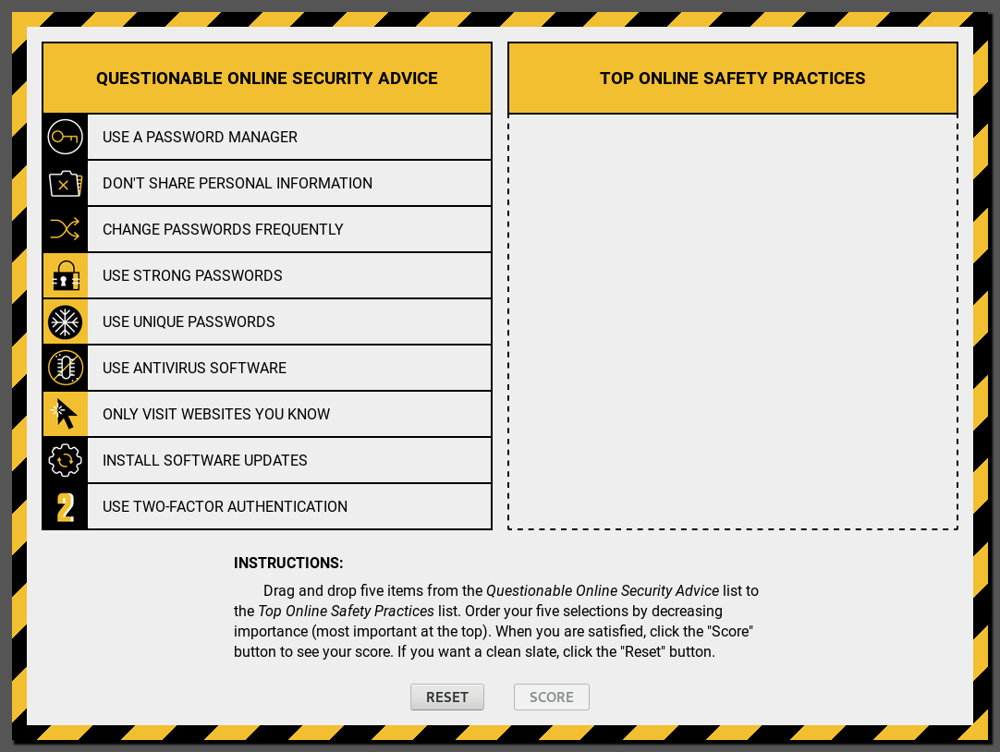

# Security Squabble

[](LICENSE) [](https://gitlab.com/RichardLitt/standard-readme "RichardLitt/standard-readme")

> A Family-Feud style game about personal internet security advice, in Vue.js

## Table of Contents

- [Background](#background)
- [Usage](#usage)
- [Contribute](#contribute)
- [License](#license)

## Background

[Family Feud](https://en.wikipedia.org/wiki/Family_Feud) is a game show where contestants attempt to name the most popular answers to humorous questions. **Security Squabble** is a single-question version of the game which asks players just one question:
> According to security experts, what are the most important ways to protect yourself online?

The game is based on a [Google Security blog post](https://security.googleblog.com/2015/07/new-research-comparing-how-security.html) which lists the "Top 5" security practices from both experts and non-experts. You can play a live version at [stma.is/squabble](https://stma.is/squabble).



## Usage

### Development

```bash
# npm install --global @vue/cli
$ npm install
$ npm run serve
```

### Deployment

```bash
# npm install --global @vue/cli
$ npm install
```
*Note*: You must set the [production `baseUrl` in `vue.config.js`](https://cli.vuejs.org/config/#baseurl) (defaults to `/squabble/`).
```
$ npm run build
```

Deploy the `dist` folder as desired for your platform; more instructions are available from the [@vue/cli guide](https://cli.vuejs.org/guide/deployment.html).

## Contribute

> Contributors to this project are expected to adhere to our [Code of Conduct](CODE_OF_CONDUCT.md "Code of Conduct").

We welcome [issues](docs/issue_template.md "Issue template"), but we prefer [pull requests](dosc/pull_request_template.md "Pull request template")! See the [contribution guidelines](docs/contributing.md "Contributing") for more information.

## License

Code in this repository is licensed under the [GNU Lesser General Public License v2.1](LICENSE). However, individual files may include content under other licenses.

Copyright 2018 [@nstickney](https://gitlab.com/nstickney)

This module is free software; you can redistribute it and/or modify it under the terms of the GNU Lesser General Public License as published by the Free Software Foundation; either version 2.1 of the License, or (at your option) any later version.

This module is distributed in the hope that it will be useful, but WITHOUT ANY WARRANTY; without even the implied warranty of MERCHANTABILITY or FITNESS FOR A PARTICULAR PURPOSE.  See the GNU Lesser General Public License for more details.

You should have received a copy of the [GNU Lesser General Public License](LICENSE) along with this module; if not, write to the Free Software Foundation, Inc., 51 Franklin Street, Fifth Floor, Boston, MA  02110-1301, USA.
